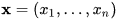
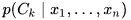
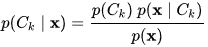

 
  

<h1 align="center"> Spam Detector </h1>
<h3 align="center"> COMP 6721 - Artificial Intelligence </h3>
<h5 align="center"> Project Assignment 2 - <a href="https://www.concordia.ca/">Concordia University</a> (Winter 2020) </h5>

 

I have developed a spam detector program in Python which classifies given emails as spam or ham using the Naive Bayes approach.

<h2> :floppy_disk: Project Files Description</h2>

This Project includes 3 executable files, 3 text files as well as 2 directories as follows:

<h4>Executable Files:</h4>
<ul>
  <li><b>spam_detector.py</b> - Includes all functions required for classification operations.</li>
  <li><b>train.py</b> - Uses the functions defined in the spam_detector.py file and generates the model.txt file after execution.</li>
  <li><b>test.py</b> - Uses the functions defined in the spam_detector.py file and, after execution, generates the result.txt as well as evaluation.txt files.</li>
</ul>

<h4>Output Files:</h4>
<ul>
  <li><b>model.txt</b> - Contains information about the vocabularies of the train set, such as the frequency and conditional probability of each word in Spam and Ham classes.</li>
  <li><b>result.txt</b> - Contains information about the classified emails of the test set.</li>
  <li><b>evaluation.txt</b> - Contains evaluation results table as well as Confusion Matrix of Spam and Ham classes.</li>
</ul>

<h4>Source Directories:</h4>
<ul>
  <li><b>train directory</b> - Includes all emails for the training phase of the program.</li>
  <li><b>test directory</b> - Includes all emails for the testing phase of the program.</li>
</ul>

<h2> :book: Naive Bayes</h2>

In machine learning, naive Bayes classifiers are a family of simple "probabilistic classifiers" based on applying Bayes' theorem with strong (naive) independence assumptions between the features.
Abstractly, naive Bayes is a conditional probability model: given a problem instance to be classified, represented by a vector

representing some n features (independent variables), it assigns to this instance probabilities

The problem with the above formulation is that if the number of features n is large or if a feature can take on a large number of values, then basing such a model on probability tables is infeasible. We therefore reformulate the model to make it more tractable. Using Bayes' theorem, the conditional probability can be decomposed as

<h2> :clipboard: Execution Instruction</h2>

The order of execution of the program files is as follows:

<b>1) spam_detector.py</b>

First, the spam_detector.py file must be executed to define all the functions and variables required for classification operations.

<b>2) train.py</b>

Then, the train.py file must be executed, which leads to the production of the model.txt file. 
At the beginning of this file, the spam_detector has been imported so that the functions defined in it can be used.

<b>3) test.py</b>

Finally, the test.py file must be executed to create the result.txt and evaluation.txt files.
Just like the train.py file, at the beginning of this file, the spam_detector has been imported so that the functions defined in it can be used.

<h2> :books: Refrences</h2>
<ul>
  <li>
Jonathan Lee, 'Notes on Naive Bayes Classifiers for Spam Filtering'. [Online].

      
Available: https://courses.cs.washington.edu/courses/cse312/18sp/lectures/naive-bayes/naivebayesnotes.pdf

  </li>
  <li>
Wikipedia.org, 'Naive Bayes Classifier'. [Online].

      
Available: https://en.wikipedia.org/wiki/Naive_Bayes_classifier

  </li>
  <li>
Youtube.com, 'Naive Bayes for Spam Detection'. [Online].

      
Available: https://www.youtube.com/watch?v=8aZNAmWKGfs

  </li>
  <li>
Youtube.com, 'Text Classification Using Naive Bayes'. [Online].

      
Available: https://www.youtube.com/watch?v=EGKeC2S44Rs

  </li>
  <li>
Manisha-sirsat.blogspot.com, 'What is Confusion Matrix and Advanced Classification Metrics?'. [Online].

      
Available: https://manisha-sirsat.blogspot.com/2019/04/confusion-matrix.html

  </li>
  <li>
Pythonforengineers.com, 'Build a Spam Filter'. [Online].

      
Available: https://www.pythonforengineers.com/build-a-spam-filter/

  </li>
</ul>

<!-- CREDITS -->
<h2 id="credits"> :scroll: Credits</h2>

✤ <i>This was the homework project for the course COMP 6721 - Artificial Intelligence (Winter 2020), at <a href="https://www.concordia.ca/">Concordia University</a><i>  
  <i>Author: Mohammad Amin Shamshiri</i>

